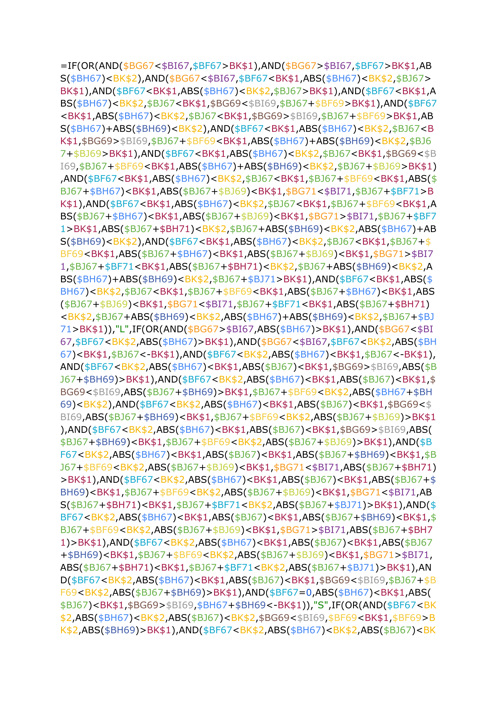
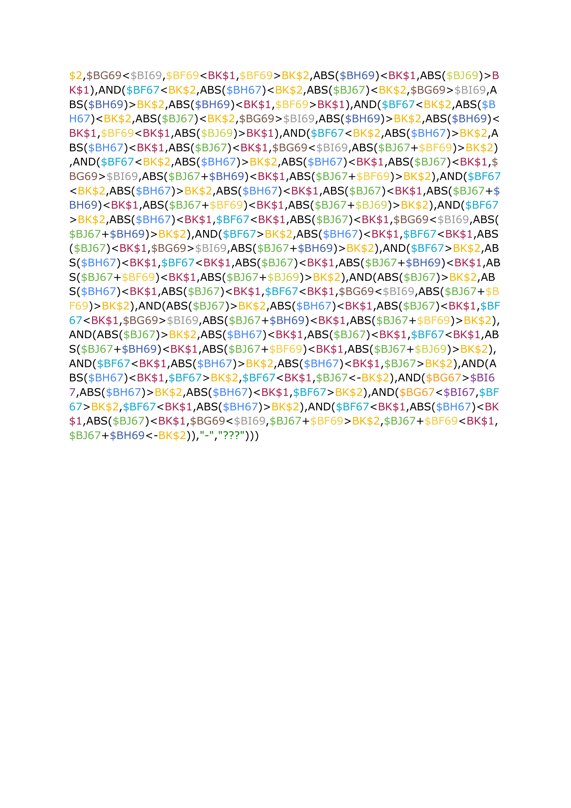

# The Cell That Broke Excel

Before I learned to program, I pushed spreadsheet formulas to their 
absolute limit. This is one surviving cell — a single formula roughly 
two A4 pages long, used for a forex take-profit/stop-loss calculation.

Duplicating this formula across multiple cells reliably broke the 
spreadsheet. That breaking point is basically what pushed me to start 
programming for real.

Each cell reference is color-coded consistently throughout — which made 
it *feel* more readable. It wasn't.

Want to see the actual mess behind it? [Draft history](draft-history.txt) — 
every half-finished attempt, merge, and dead end along the way.
